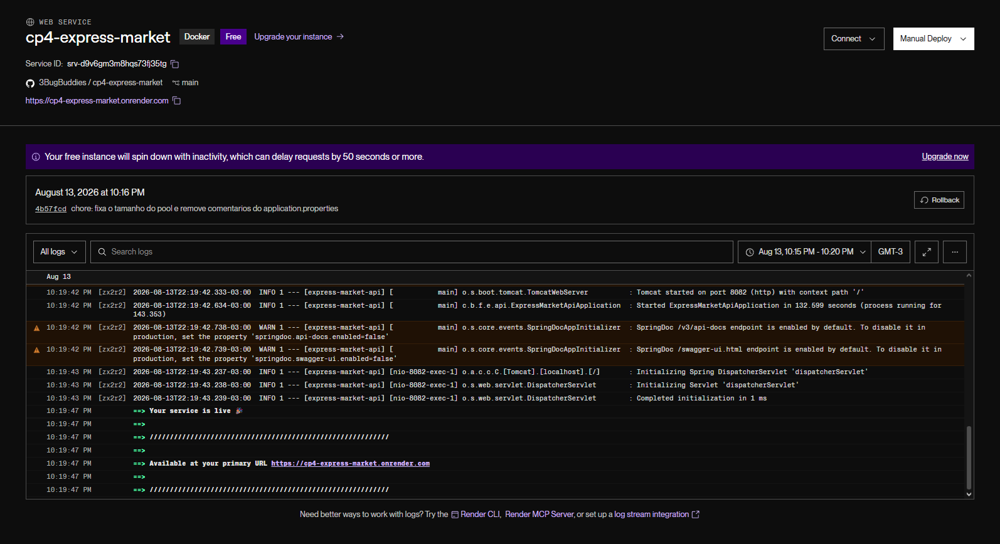
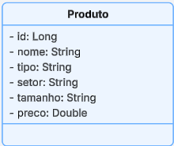
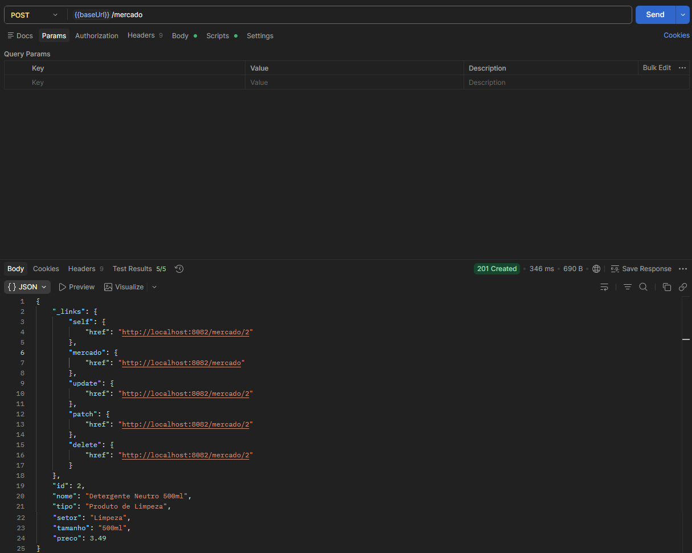
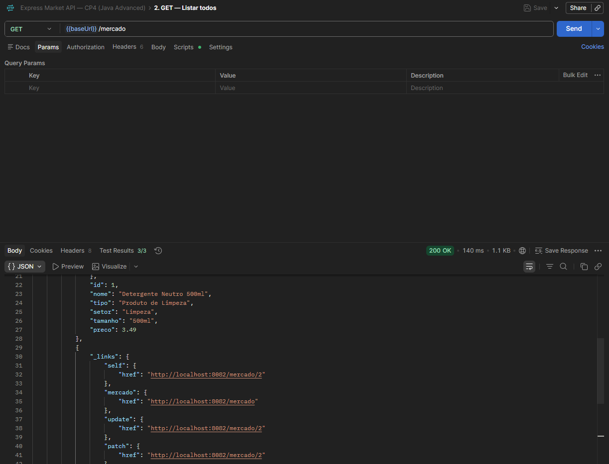
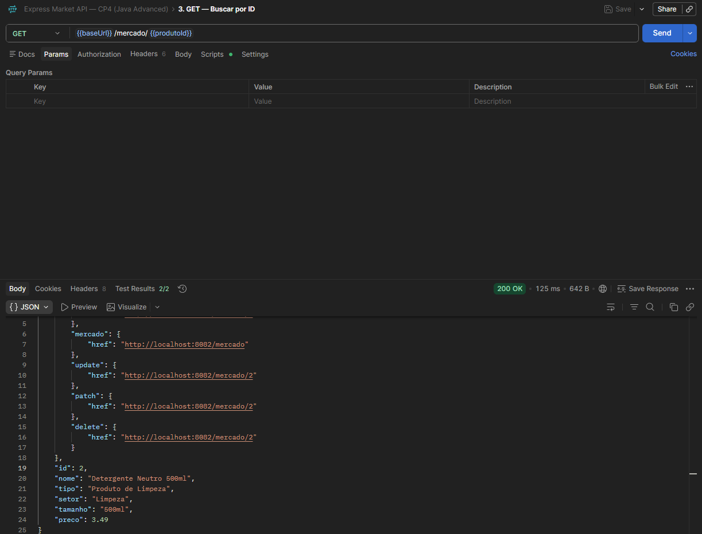
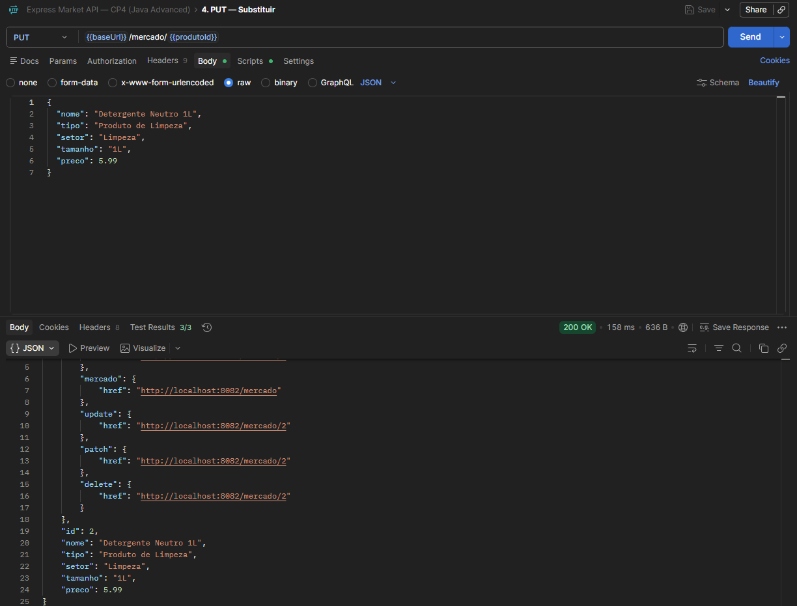
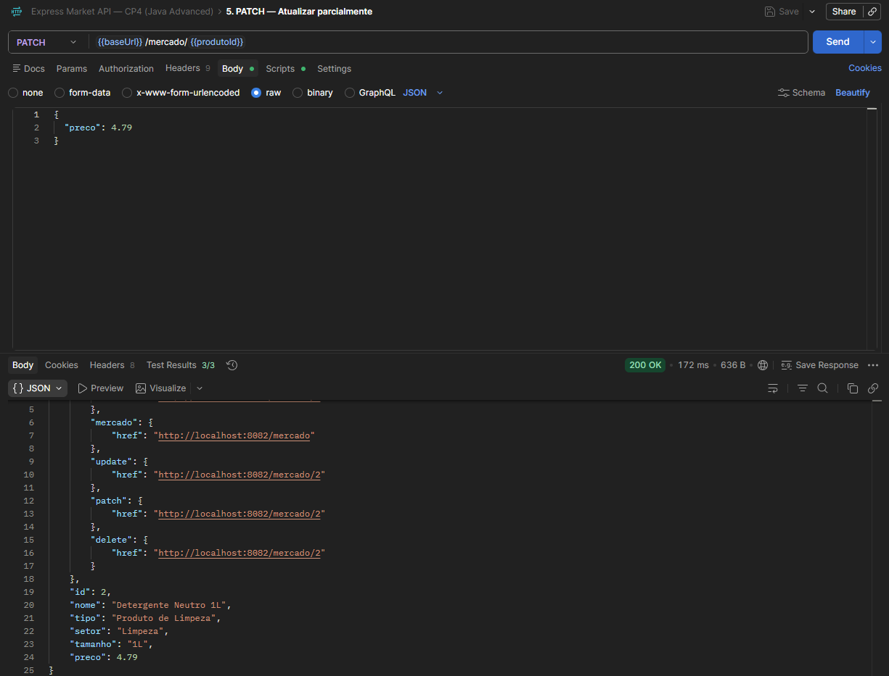
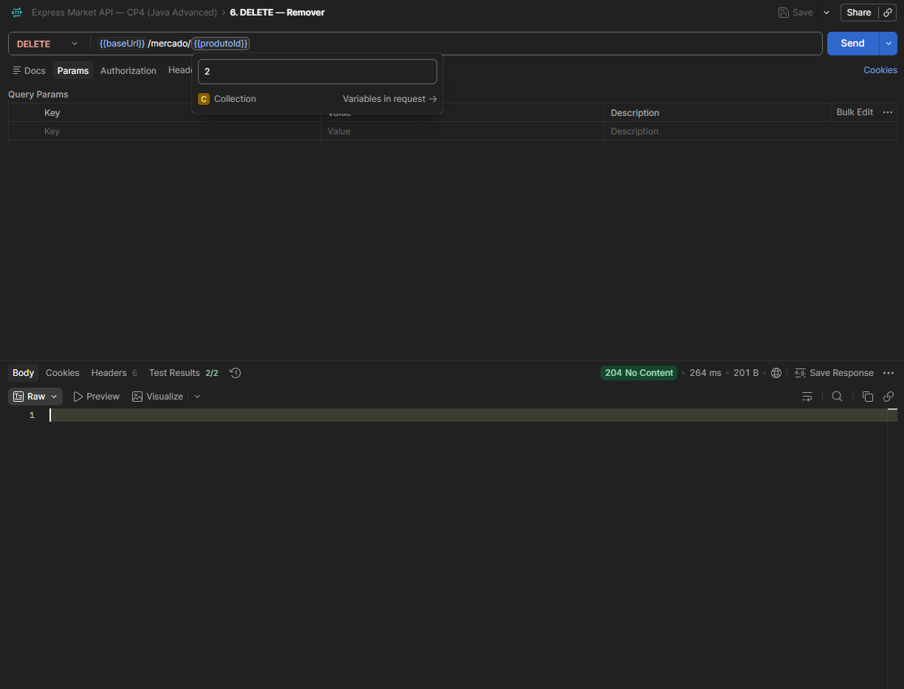
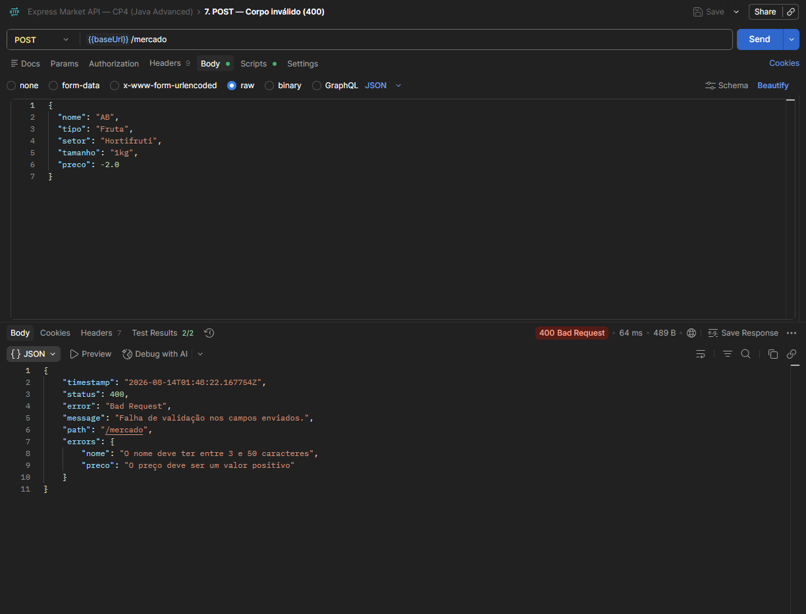
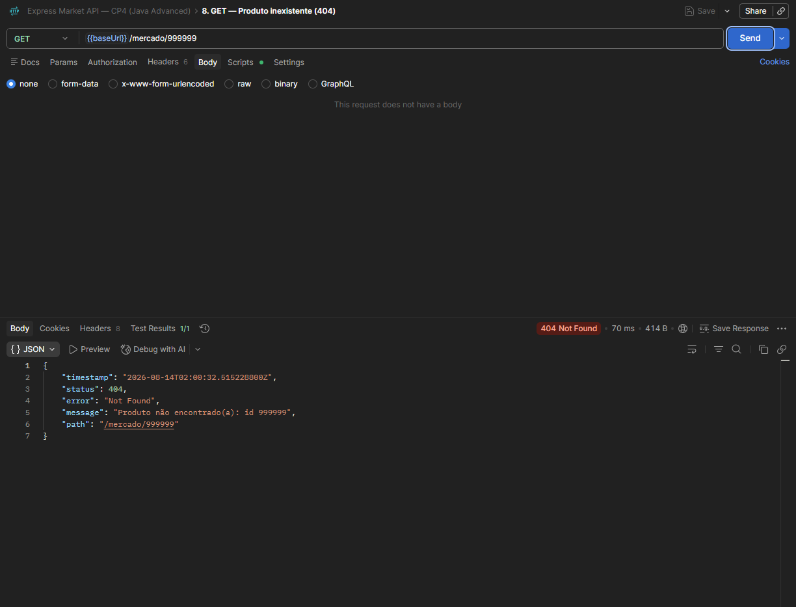

# Express Market API — CheckPoint 4 (Parte I) | Java Advanced

API REST desenvolvida com Spring Boot para gerenciamento do estoque de um mercado express, como parte do CheckPoint 4 — Parte I da disciplina de Java Advanced (TDS) — FIAP.

---

## Deploy

| Recurso         | URL |
|-----------------|-----|
| Deploy (Render) | https://cp4-express-market.onrender.com/ |
| Swagger UI      | https://cp4-express-market.onrender.com/swagger-ui/index.html |


> 

---


## Integrantes do Grupo

| Nome | RM |
|------|----|
| Felipe Yuiti Ishii | 565339 |
| Gabriel Nogueira Peixoto | 563925 |
| Giovanna Neri dos Santos | 566154 |
| Mariana Inoue | 565834 |

**IDE utilizada:** IntelliJ IDEA

---

## Configuração do Projeto — Spring Initializr


### Dependências

| Dependência | Categoria | Descrição |
|-------------|-----------|-----------|
| Spring Web | WEB | Criação de APIs REST com Spring MVC |
| Spring HATEOAS | WEB | Links de navegação nas respostas (maturidade nível 3) |
| SpringDoc OpenAPI | WEB | Documentação interativa da API via Swagger UI |
| Spring Data JPA | SQL | Persistência com JPA e Hibernate |
| Validation | I/O | Bean Validation com Hibernate Validator |
| Lombok | Developer Tools | Redução de boilerplate (getters, setters, construtores) |
| Oracle Driver | SQL | Driver JDBC para Oracle Database |
| Spring Boot DevTools | Developer Tools | LiveReload e reinicialização automática |

---


## Estrutura do Projeto

```
src/
└── main/
    ├── java/com/br/fiap/expressmarket/api/
    │   ├── ExpressMarketApiApplication.java   # Classe principal
    │   ├── assembler/
    │   │   └── ProdutoModelAssembler.java     # Montagem dos links HATEOAS
    │   ├── config/
    │   │   ├── CorsConfig.java                # Liberação de origens (CORS)
    │   │   └── OpenApiConfig.java             # Metadados da Swagger UI
    │   ├── controller/
    │   │   └── ProdutoController.java         # Endpoints REST
    │   ├── dto/
    │   │   ├── ProdutoRequest.java            # Corpo do POST e do PUT
    │   │   ├── ProdutoPatchRequest.java       # Corpo do PATCH (campos opcionais)
    │   │   └── ProdutoResponse.java           # Representação devolvida pela API
    │   ├── entity/
    │   │   └── Produto.java                   # Entidade JPA
    │   ├── exception/
    │   │   └── NotFoundException.java         # Recurso inexistente
    │   ├── handler/
    │   │   ├── GlobalExceptionHandler.java    # Traduz exceções em respostas HTTP
    │   │   └── ErrorResponse.java             # Corpo das respostas de erro
    │   ├── repository/
    │   │   └── ProdutoRepository.java         # Interface de acesso a dados
    │   └── service/
    │       └── ProdutoService.java            # Regras de negócio
    └── resources/
        └── application.properties            # Configurações da aplicação
```

---

## Por que Repository e não DAO?

O Spring Data JPA já gerencia o `EntityManager` automaticamente — ciclo de vida, transações, thread-safety. O `JpaRepository` entrega o CRUD pronto via interface, sem precisar implementar nada na mão.

DAO faria sentido se precisássemos de controle fino sobre o `EntityManager`. Aqui, o Spring cuida disso melhor do que faríamos manualmente.

---

## Como Executar

### Pré-requisitos

- Java 21+
- Maven 3.9+

### Rodando a aplicação

```bash
# Clonar o repositório
git clone https://github.com/3BugBuddies/cp4-express-market.git

# Entrar na pasta do projeto
cd cp4-express-market

# Configurar application.properties com suas credenciais do Oracle
# (ver a seção "Configuração do Banco de Dados" abaixo)

# Executar com Maven
./mvnw spring-boot:run
```

A aplicação sobe em `http://localhost:8082`.

---

## Configuração de CORS

O `CorsConfig` libera o consumo da API por front-ends hospedados em outra origem. As origens permitidas vêm de uma propriedade, o que permite abrir em desenvolvimento e restringir no deploy sem recompilar:

```properties
# Todas as origens (desenvolvimento)
cors.allowed-origins=*

# Origens específicas (produção)
cors.allowed-origins=https://meu-front.com,https://admin.meu-front.com
```

Métodos liberados: `GET`, `POST`, `PUT`, `PATCH`, `DELETE` e `OPTIONS`. O header `Location` é exposto explicitamente, senão o browser não conseguiria ler a URL do recurso criado pelo POST.


---

## Configuração do Banco de Dados

Banco Oracle disponibilizado pela FIAP. Configure `src/main/resources/application.properties` com suas credenciais:

```properties
spring.datasource.url=jdbc:oracle:thin:@oracle.fiap.com.br:1521:ORCL
spring.datasource.username=<SEU_RM>
spring.datasource.password=<SUA_SENHA>
spring.datasource.driver-class-name=oracle.jdbc.OracleDriver
spring.jpa.database-platform=org.hibernate.dialect.OracleDialect
spring.jpa.hibernate.ddl-auto=update
spring.jpa.show-sql=true
spring.jpa.properties.hibernate.format_sql=true
```

### Print do Banco de Dados

> 

---

## Modelo de Dados

### Diagrama de Classe



---

## Endpoints da API

Base URL: `https://cp4-express-market.onrender.com/mercado`

| Método | Rota | Descrição | Status de Sucesso |
|--------|------|-----------|-------------------|
| `POST` | `/mercado` | Cadastrar novo produto | `201 Created` |
| `GET` | `/mercado` | Listar todos os produtos | `200 OK` |
| `GET` | `/mercado/{id}` | Buscar produto por ID | `200 OK` |
| `PUT` | `/mercado/{id}` | Substituir produto existente | `200 OK` |
| `PATCH` | `/mercado/{id}` | Atualizar campos específicos | `200 OK` |
| `DELETE` | `/mercado/{id}` | Remover produto | `204 No Content` |

Requisição em recurso inexistente devolve `404 Not Found`; corpo inválido devolve `400 Bad Request` com a lista de campos rejeitados.

---

## Testes

Todos os testes abaixo foram executados contra `http://localhost:8082`.

### Coleção pronta

O repositório traz uma coleção com os 8 cenários já montados, incluindo asserções automáticas de status, de campos e da presença dos links HATEOAS:

```
postman/express-market-api.postman_collection.json
```

**Postman:** `Import` → selecione o arquivo → rode com o **Collection Runner**.
**Insomnia:** `Import` → `From File` → selecione o mesmo arquivo.


| # | Cenário | Esperado |
|---|---------|----------|
| 1 | POST — Criar produto | `201` + header `Location` + links HATEOAS |
| 2 | GET — Listar todos | `200` + coleção em `_embedded` |
| 3 | GET — Buscar por ID | `200` + id correspondente |
| 4 | PUT — Substituir | `200` + todos os campos trocados |
| 5 | PATCH — Atualizar parcialmente | `200` + só o campo enviado muda |
| 6 | DELETE — Remover | `204` sem corpo |
| 7 | POST — Corpo inválido | `400` + erros por campo |
| 8 | GET — Produto inexistente | `404` |

### POST — Criar produto

Cadastra um novo produto na tabela `TDS_TB_mercado` e retorna o objeto criado com o ID gerado pela sequence, além do header `Location`.

**Requisição** — `POST /mercado`

```json
{
  "nome": "Detergente Neutro 500ml",
  "tipo": "Produto de Limpeza",
  "setor": "Limpeza",
  "tamanho": "500ml",
  "preco": 3.49
}
```

**Resposta** — `201 Created`

```json
{
  "_links": {
    "self":    { "href": "http://localhost:8082/mercado/2" },
    "mercado": { "href": "http://localhost:8082/mercado" },
    "update":  { "href": "http://localhost:8082/mercado/2" },
    "patch":   { "href": "http://localhost:8082/mercado/2" },
    "delete":  { "href": "http://localhost:8082/mercado/2" }
  },
  "id": 2,
  "nome": "Detergente Neutro 500ml",
  "tipo": "Produto de Limpeza",
  "setor": "Limpeza",
  "tamanho": "500ml",
  "preco": 3.49
}
```

> 

---

### GET — Listar todos

Retorna todos os produtos cadastrados. A coleção vem em `_embedded`, com os links de cada item preservados.

**Requisição** — `GET /mercado`

**Resposta** — `200 OK`

```json
{
  "_embedded": {
    "produtoResponseList": [
      {
        "_links": {
          "self":    { "href": "http://localhost:8082/mercado/2" },
          "mercado": { "href": "http://localhost:8082/mercado" },
          "update":  { "href": "http://localhost:8082/mercado/2" },
          "patch":   { "href": "http://localhost:8082/mercado/2" },
          "delete":  { "href": "http://localhost:8082/mercado/2" }
        },
        "id": 2,
        "nome": "Detergente Neutro 500ml",
        "tipo": "Produto de Limpeza",
        "setor": "Limpeza",
        "tamanho": "500ml",
        "preco": 3.49
      }
    ]
  },
  "_links": {
    "self": { "href": "http://localhost:8082/mercado" }
  }
}
```

> 

---

### GET — Buscar por ID

Retorna um produto específico. Devolve `404` se o ID não existir.

**Requisição** — `GET /mercado/2`

> 

---

### PUT — Substituir

Substitui **todos** os campos do produto. Todos os campos são obrigatórios no corpo. Se o ID não existir, devolve `404` — o PUT não cria registro novo.

**Requisição** — `PUT /mercado/2`

```json
{
  "nome": "Detergente Neutro 1L",
  "tipo": "Produto de Limpeza",
  "setor": "Limpeza",
  "tamanho": "1L",
  "preco": 5.99
}
```

> 

---

### PATCH — Atualizar parcialmente

Atualiza **somente** os campos enviados. Os campos ausentes mantêm o valor já persistido — é a diferença prática para o PUT.

**Requisição** — `PATCH /mercado/2`

```json
{
  "preco": 4.79
}
```

> 

---

### DELETE — Remover

Remove o produto do banco pelo ID. Devolve `204 No Content` em caso de sucesso ou `404` se o ID não existir.

**Requisição** — `DELETE /mercado/2`

> 

---

### Erro de validação

Corpo inválido é traduzido pelo `GlobalExceptionHandler` em uma resposta legível, em vez de stacktrace.

**Requisição** — `POST /mercado`

```json
{
  "nome": "AB",
  "tipo": "Fruta",
  "setor": "Hortifruti",
  "tamanho": "1kg",
  "preco": -2.0
}
```

**Resposta** — `400 Bad Request`

```json
{
  "timestamp": "2026-08-13T22:10:31.482Z",
  "status": 400,
  "error": "Bad Request",
  "message": "Falha de validação nos campos enviados.",
  "path": "/mercado",
  "errors": {
    "nome": "O nome deve ter entre 3 e 50 caracteres",
    "preco": "O preço deve ser um valor positivo"
  }
}
```

> 

---

### Recurso inexistente

Qualquer operação sobre um id que não existe devolve `404` no mesmo formato. O campo `errors` só aparece em falhas de validação, então aqui ele é omitido.

**Requisição** — `GET /mercado/999999`

**Resposta** — `404 Not Found`

```json
{
  "timestamp": "2026-08-13T22:11:04.118Z",
  "status": 404,
  "error": "Not Found",
  "message": "Produto não encontrado(a): id 999999",
  "path": "/mercado/999999"
}
```
> 
---

## Tecnologias Utilizadas

- **Java 21**
- **Spring Boot 4.0.7**
- **Spring Data JPA + Hibernate**
- **Spring Web (MVC)**
- **Spring HATEOAS**
- **SpringDoc OpenAPI 3.0.2 (Swagger UI)**
- **Bean Validation (Hibernate Validator)**
- **Lombok**
- **Oracle Database (OJDBC 11)**
- **Maven**
